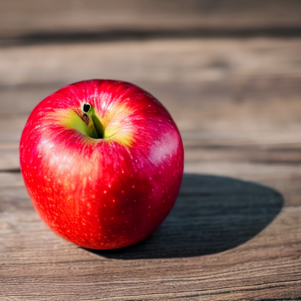
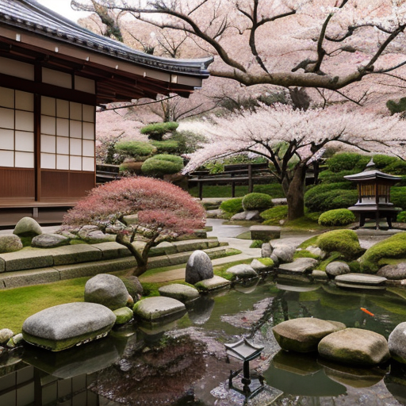
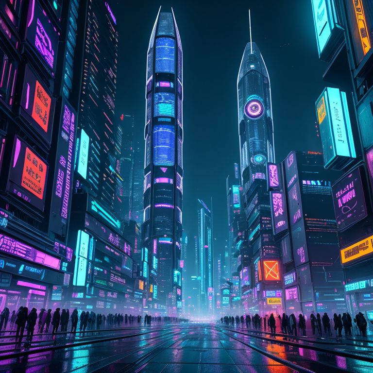

# Local Open-Source Text-to-Image Generator

A complete text-to-image generation system using Stable Diffusion, optimized for Apple Silicon (M1/M2/M3/M4) with MPS backend support.


## 🎨 Features

- ✅ **Runs locally** on MacBook (MPS), NVIDIA GPUs (CUDA), or CPU
- ✅ **Open-source models** - no API costs
- ✅ **Style presets** - photorealistic, anime, cinematic, etc.
- ✅ **Streamlit web UI** - intuitive interface
- ✅ **Metadata saving** - full reproducibility
- ✅ **Multiple formats** - PNG/JPEG export
- ✅ **Batch generation** - generate up to 4 images at once

## 📋 Requirements

### Hardware
- **Recommended**: MacBook Pro M1/M2/M3/M4 with 16GB+ RAM
- **Minimum**: 8GB RAM, ~5GB storage for model
- **GPU**: Apple Silicon MPS, NVIDIA CUDA, or CPU fallback

### Software
- Python 3.10 or 3.11
- macOS 12+ (for MPS support)

## 🚀 Installation

### Step 1: Clone Repository
```
git clone https://github.com/a-145198/text2image-project.git
cd text2image-project
```

### Step 2: Create Virtual Environment
```
python3 -m venv venv
source venv/bin/activate  # On Windows: venv\Scripts\activate
```

**Or using Conda:**
```
conda create --name text2image python=3.11 -y
conda activate text2image
```

### Step 3: Install PyTorch with MPS Support
```
# For Apple Silicon (M1/M2/M3/M4)
pip install torch torchvision torchaudio

# Or via Conda
conda install pytorch torchvision torchaudio -c pytorch
```

### Step 4: Install Dependencies
```
pip install -r requirements.txt
```

### Step 5: Login to Hugging Face (Optional but Recommended)
```
pip install huggingface_hub
huggingface-cli login
```

## 💻 Usage

### Run Streamlit App
```
streamlit run src/app_streamlit.py
```

The app will open in your browser at `http://localhost:8501`

### Using the Interface

1. **Load Model**: Click "Load Model" in sidebar (first time takes ~2-3 minutes)
2. **Enter Prompt**: Describe the image you want
3. **Adjust Settings**: Choose style, steps, guidance scale
4. **Generate**: Click "Generate Images"
5. **Download**: Save your favorite images

### Example Prompt
```
a serene Japanese garden with cherry blossoms, koi pond, 
stone lanterns, misty morning light, highly detailed
```

## ⚙️ Parameters Guide

| Parameter | Range | Description |
|-----------|-------|-------------|
| **Steps** | 10-50 | More steps = better quality (but slower) |
| **Guidance Scale** | 1-20 | How closely to follow prompt (7-15 recommended) |
| **Width/Height** | 512-1024 | Image dimensions (512x512 is fastest) |
| **Seed** | Any int | For reproducible results |

## 🎯 Prompt Engineering Tips

### Structure
```
[Subject] + [Description] + [Style] + [Quality boosters]
```

### Quality Boosters
- `highly detailed`
- `4K` or `8K`
- `professional photography`
- `cinematic lighting`
- `masterpiece`

### Negative Prompts
Always include: `lowres, blurry, bad quality, watermark, distorted`

### Style Keywords
- **Photorealistic**: `professional photography, sharp focus, realistic lighting`
- **Artistic**: `oil painting, masterpiece, by greg rutkowski`
- **Anime**: `anime style, manga, vibrant colors`
- **Cinematic**: `movie still, dramatic lighting, epic composition`

## 📁 Project Structure

```
text2image-project/
├── README.md
├── requirements.txt
├── .gitignore
├── configs/
│   └── default_config.yaml
├── src/
│   ├── generator.py          # Core generation logic
│   ├── utils.py               # Prompt engineering utilities
│   ├── storage.py             # Image/metadata saving
│   └── app_streamlit.py       # Web interface
├── outputs/                   # Generated images (auto-created)
└── examples/
    ├── prompts.txt            # Example prompts
    └── sample_metadata.json   # Metadata example
```

## 🛠️ Troubleshooting

### Model Loading Issues
**Problem**: `RuntimeError: MPS backend not available`

**Solution**: Ensure macOS 12.3+ and run:
```
import torch
print(torch.backends.mps.is_available())  # Should be True
```

### Memory Errors on 16GB Mac
**Problem**: `RuntimeError: MPS out of memory`

**Solutions**:
- Close other apps (especially Chrome)
- Reduce image size to 512x512
- Generate 1 image at a time
- The code uses `enable_attention_slicing()` automatically

### Slow Generation
**Expected**: First generation takes longer (model loading + warmup)

**Normal speed**: ~30-60 seconds per image on M-series Macs

**Speed up**: Reduce steps to 20-25 for faster results

### CUDA Not Available (Expected on Mac)
This is normal! The project uses MPS for Apple Silicon. CUDA is for NVIDIA GPUs.

## 📊 Performance Benchmarks

**MacBook Pro M4 (16GB RAM)**:
- Model loading: ~90 seconds (first time)
- 512x512, 30 steps: ~25-35 seconds
- 768x768, 50 steps: ~90-120 seconds

## ✅ Requirements Fulfillment

This project fully meets all internship task requirements:

- **Model Selection:** Open-source Stable Diffusion models (v1.5, AbsoluteReality) running locally with PyTorch
- **Local Execution:** Optimized for Apple Silicon MPS with automatic CPU fallback
- **Text-to-Image:** Accepts text prompts with adjustable parameters (steps, guidance, resolution, style presets)
- **User Interface:** Streamlit web UI with prompt entry, parameter controls, image viewing, and download
- **Progress Display:** Real-time progress bar and status updates during generation
- **Quality Enhancement:** Automated prompt engineering with 8 style presets and negative prompt support
- **Storage:** Date-organized folders with complete metadata (JSON) for every generation
- **Export:** Both PNG and JPEG formats with sanitized filenames

**Bonus Features:**
- Multiple model support (SD 1.5, AbsoluteReality, easy to extend)
- Seed control for reproducibility
- Comprehensive documentation with troubleshooting
- Example prompts library
- Device optimization (MPS/CUDA/CPU auto-detection)

## 🔒 Ethical AI Guidelines

### Responsible Use
- ✅ Creative projects, art, design
- ✅ Educational purposes
- ✅ Personal entertainment
- ❌ Deepfakes or deceptive content
- ❌ Copyrighted character reproductions
- ❌ Harmful or illegal content

### Content Filtering
The app includes basic negative prompts. For production use, implement:
- Keyword blocklists
- Image classification filters
- User reporting system

### Attribution
- Mark images as "AI-Generated"
- Credit: Stable Diffusion by StabilityAI
- License: Model-dependent (check HuggingFace)

## 🚧 Limitations

- **Generation Time**: 30-60 seconds per image
- **Resolution**: Best at 512x512 (larger = slower & more memory)
- **Consistency**: Results vary even with same prompt
- **Training Data**: May reflect biases from training set
- **Local Only**: Requires decent hardware

## 🔮 Future Improvements

- [ ] ControlNet integration (pose control)
- [ ] Img2Img functionality
- [ ] Inpainting support
- [ ] LoRA fine-tuning
- [ ] Multiple model support (SDXL, SD 2.1)
- [ ] Upscaling integration
- [ ] Prompt history/favorites
- [ ] Batch processing from file

## 📚 Technology Stack

- **PyTorch** 2.0+ (MPS backend)
- **Diffusers** (Hugging Face)
- **Transformers** (Text encoding)
- **Streamlit** (Web UI)
- **Pillow** (Image processing)

## 📚 Supported Models

### Default Models
- `runwayml/stable-diffusion-v1-5` - General purpose, fast
- `Yntec/AbsoluteReality` - Photorealistic specialist

### Easy to Add
- `SG161222/Realistic_Vision_V5.1_noVAE` - Portrait specialist
- `Lykon/DreamShaper` - Artistic style
- `prompthero/openjourney` - Midjourney-style
- `stabilityai/stable-diffusion-xl-base-1.0` - Highest quality (slower)

Simply change the `model_id` in the Streamlit sidebar!

## 📄 License

MIT License - feel free to use for personal/commercial projects

## 🙏 Acknowledgments

- **StabilityAI** - Stable Diffusion model
- **Hugging Face** - Diffusers library
- **Streamlit** - Web framework
- **PyTorch** - Deep learning framework

## 📞 Support

For issues or questions:
1. Check the troubleshooting section
2. See example prompts in `examples/prompts.txt`
3. Review Hugging Face docs: https://huggingface.co/docs/diffusers

---

*Transform your imagination into reality with AI* 🎨✨
```

***

## 📸 Sample Outputs

Generated using AbsoluteReality and Stable Diffusion v1.5 models, demonstrating three difficulty levels:

### Easy: Simple Subject (20 steps, ~25s)


**Prompt:** `a red apple on a wooden table, natural lighting`  
**Model:** Stable Diffusion v1.5 | **Steps:** 20 | **Resolution:** 512×512

---

### Medium: Detailed Scene (30 steps, ~40s)


**Prompt:** `a serene Japanese garden with cherry blossoms, stone lanterns, koi pond, misty morning light, professional photography, highly detailed`  
**Model:** AbsoluteReality | **Steps:** 30 | **Resolution:** 512×512

---

### Complex: Advanced Composition (40 steps, ~90s)


**Prompt:** `epic futuristic cyberpunk city at night, neon lights reflecting on wet streets, flying cars with glowing trails, holographic advertisements, towering skyscrapers, dramatic volumetric lighting, cinematic wide shot, ultra detailed, 8K, masterpiece`  
**Model:** AbsoluteReality | **Steps:** 40 | **Resolution:** 768×768

---
```
